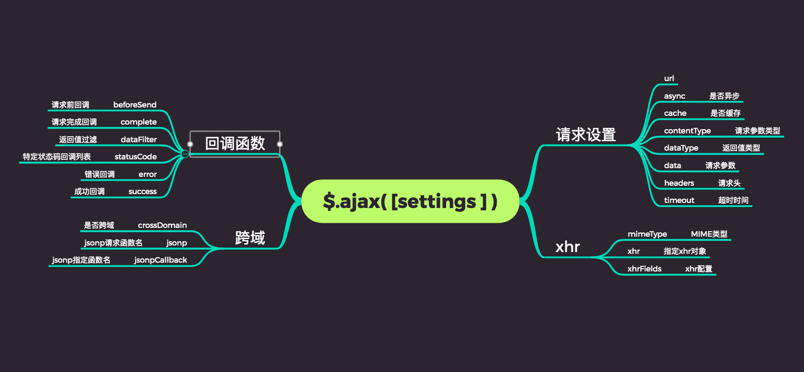

# a simple ajax （借鉴 jquery）

是 jquery ajax 的剥离版本，基本兼容jquery 几乎所有常用方法和属性，支持 AMD CMD ES6写法（IE 不支持）。

移除了原本兼容IE6 IE7的兼容代码。

移除了jquery的global method （）

## 兼容性

IE8+

## 使用

支持 AMD,CMD,浏览器方式

## 快捷方法

ajax.get()

ajax.post()

ajax.getJSON()

ajax.ajaxSetup()

// 同 $.ajax 方法


## 支持的参数

url
> (一个用来包含发送请求的URL字符串。)

accepts
> (默认： 取决于数据类型。)
内容类型发送请求头，告诉服务器什么样的响应会接受返回。如果accepts设置需要修改，推荐在$.ajaxSetup()方法中做一次。

async
> (默认: true) 默认设置下，所有请求均为异步请求。如果需要发送同步请求，请将此选项设置为 false。注意，
同步请求将锁住浏览器，用户其它操作必须等待请求完成才可以执行。)

beforeSend(XHR)
> (发送请求前可修改 XMLHttpRequest 对象的函数，如添加自定义 HTTP 头。XMLHttpRequest 对象是唯一的参数。
这是一个 Ajax 事件。如果返回false可以取消本次ajax请求。 )
```
function (XMLHttpRequest) {
    this; // 调用本次AJAX请求时传递的options参数
}
```

complete(XHR, TS)
> 请求完成后回调函数 (请求成功或失败之后均调用)。参数： XMLHttpRequest 对象和一个描述成功请求类型的字符串。
```
function (XMLHttpRequest, textStatus) {
    this; // 调用本次AJAX请求时传递的options参数
}
```

contentType
> (默认: "application/x-www-form-urlencoded") 发送信息至服务器时内容编码类型。默认值适合大多数情况。
如果你明确地传递了一个content-type给 $.ajax() 那么他必定会发送给服务器（即使没有数据要发送）

context
> (这个对象用于设置Ajax相关回调函数的上下文。也就是说，让回调函数内this指向这个对象（如果不设定这个参数，
那么this就指向调用本次AJAX请求时传递的options参数）。
比如指定一个DOM元素作为context参数，这样就设置了success回调函数的上下文为这个DOM元素。就像这样： )
```
$.ajax({ url: "test.html", context: document.body, success: function(){
    $(this).addClass("done");
}});
```

crossDomain
> (默认： 同域请求为false)
跨域请求为true如果你想强制跨域请求（如JSONP形式）同一域，设置crossDomain为true。这使得例如，服务器端重定向到另一个域

data
> (发送到服务器的数据。将自动转换为请求字符串格式。GET 请求中将附加在 URL 后。查看 processData 选项说明以禁止此自动转换。
必须为 Key/Value 格式。如果为数组，jQuery 将自动为不同值对应同一个名称。如 {foo:["bar1", "bar2"]} 转换为 "&foo=bar1&foo=bar2"。)

dataType
> 预期服务器返回的数据类型。如果不指定，jQuery 将自动根据 HTTP 包 MIME 信息来智能判断，比如XML MIME类型就被识别为XML。在1.4中，JSON就会生成一个JavaScript对象，而script则会执行这个脚本。
随后服务器端返回的数据会根据这个值解析后，传递给回调函数。可用值:

"xml": 返回 XML 文档，可用 jQuery 处理。

"html": 返回纯文本 HTML 信息；包含的script标签会在插入dom时执行。

"json": 返回 JSON 数据 。

"jsonp": JSONP 格式。使用 JSONP 形式调用函数时，如 "myurl?callback=?" jQuery 将自动替换 ? 为正确的函数名，以执行回调函数。

"text": 返回纯文本字符串

"*": 任意类型


error(XMLHttpRequest, textStatus, errorThrown)
> (默认: 自动判断 (xml 或 html)) 请求失败时调用此函数。有以下三个参数：XMLHttpRequest 对象、错误信息、（可选）捕获的异常对象。如果发生了错误，错误信息（第二个参数）
除了得到null之外，还可能是"timeout", "error", "notmodified" 和 "parsererror"。
```
function (XMLHttpRequest, textStatus, errorThrown) {
    // 通常 textStatus 和 errorThrown 之中
    // 只有一个会包含信息
    this; // 调用本次AJAX请求时传递的options参数
}
```

headers
> 一个额外的"{键:值}"对映射到请求一起发送。此设置被设置之前beforeSend函数被调用;因此，消息头中的值设置可以在覆盖beforeSend函数范围内的任何设置。


jsonp
> 在一个jsonp请求中重写回调函数的名字。这个值用来替代在"callback=?"这种GET或POST请求中URL参数里的"callback"部分，
比如{jsonp:'onJsonPLoad'}会导致将"onJsonPLoad=?"传给服务器。

jsonpCallback
> 为jsonp请求指定一个回调函数名。这个值将用来取代jQuery自动生成的随机函数名。这主要用来让jQuery生成度独特的函数名，
这样管理请求更容易，也能方便地提供回调函数和错误处理。你也可以在想让浏览器缓存GET请求的时候，指定这个回调函数名。


success(data, textStatus, jqXHR)
> 请求成功后的回调函数。参数：由服务器返回，并根据dataType参数进行处理后的数据；描述状态的字符串。还有 jqXHR（在jQuery 1.4.x的中，
XMLHttpRequest） 对象 。在jQuery 1.5， 成功设置可以接受一个函数数组。每个函数将被依次调用

```
function (data, textStatus) {
    // data 可能是 xmlDoc, jsonObj, html, text, 等等...
    this; // 调用本次AJAX请求时传递的options参数
}
```

timeout
> 设置请求超时时间（毫秒）。此设置将覆盖全局设置。

type
> (默认: "GET") 请求方式 ("POST" 或 "GET")， 默认为 "GET"。注意：其它 HTTP 请求方法，如 PUT 和 DELETE 也可以使用，但仅部分浏览器支持。

username
> 用于响应HTTP访问认证请求的用户名

password
> 用于响应HTTP访问认证请求的密码

processData
> (默认: true) 默认情况下，通过data选项传递进来的数据，如果是一个对象(技术上讲只要不是字符串)，
都会处理转化成一个查询字符串，以配合默认内容类型 "application/x-www-form-urlencoded"。
如果要发送 DOM 树信息或其它不希望转换的信息，请设置为 false。


xhrFields
> 对象object。可以支持 withCredentials，Access-Control-Allow-Credentials，参数
其中 withCredentials 兼容性是 IE10+


mimeType
> (一个mime类型用来覆盖XHR的 MIME类型。)

ifModified
> ((默认: false) 仅在服务器数据改变时获取新数据。使用 HTTP 包 Last-Modified 头信息判断。
也会检查服务器指定的'etag'来确定数据没有被修改过。)

cache
> ((默认: true,dataType为script和jsonp时默认为false) 设置为 false 将不缓存此页面。)


## 暂不支持的参数

xhr
> （采用默认的 xhr（XMLHttpRequest，兼容ie8+）

traditional
> （如果你想要用传统的方式来序列化数据，那么就设置为true。请参考工具分类下面的jQuery.param 方法。）

statusCode
> （一组数值的HTTP代码和函数对象，当响应时调用了相应的代码。例如，如果响应状态是404，将触发以下警报： ）
```
$.ajax({
  statusCode: {404: function() {
    alert('page not found');
  }
});
```

isLocal
> (默认: 取决于当前的位置协议)
(允许当前环境被认定为“本地”，（如文件系统），即使jQuery默认情况下不会承认它。
以下协议目前公认为本地：file, *-extension, and widget。如果isLocal设置需要修改，建议在$.ajaxSetup()方法中这样做一次。)

global
> (默认: true) 是否触发全局 AJAX 事件。设置为 false 将不会触发全局 AJAX 事件，如 ajaxStart 或 ajaxStop 可用于控制不同的 Ajax 事件。

dataFilter
> (给Ajax返回的原始数据的进行预处理的函数。提供data和type两个参数：data是Ajax返回的原始数据，
type是调用jQuery.ajax时提供的dataType参数。函数返回的值将由jQuery进一步处理。 )

converters
> (默认： {"* text": window.String, "text html": true, "text json": jQuery.parseJSON, "text xml": jQuery.parseXML})
(一个数据类型对数据类型转换器的对象。每个转换器的值是一个函数，返回响应的转化值)


contents
> 一个以"{字符串:正则表达式}"配对的对象，用来确定jQuery将如何解析响应，给定其内容类型。


## 支持 promise化（ IE 不支持）

添加了promise ，支持 then 和 catch 方法。IE 不支持。。。

在promise上面扩展了 xhr 对象，方便之处 abort 和 process 方法。


## 整体效果

</img>

